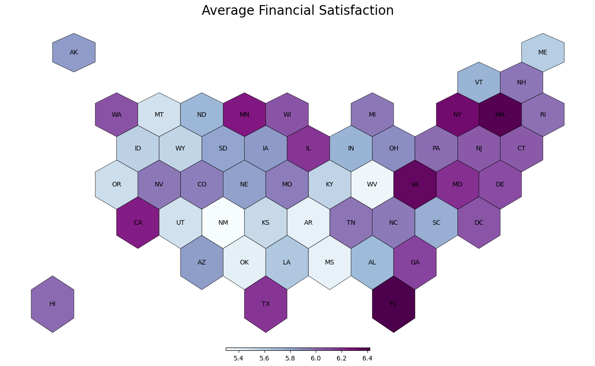
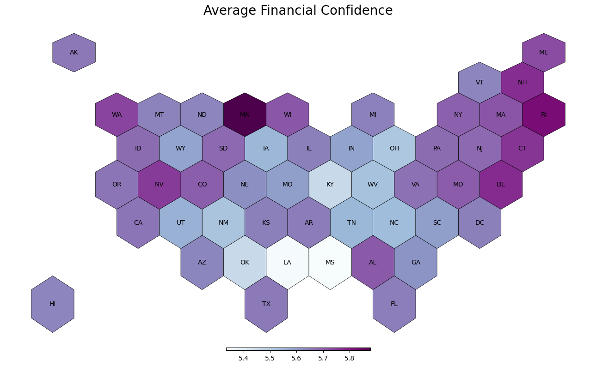
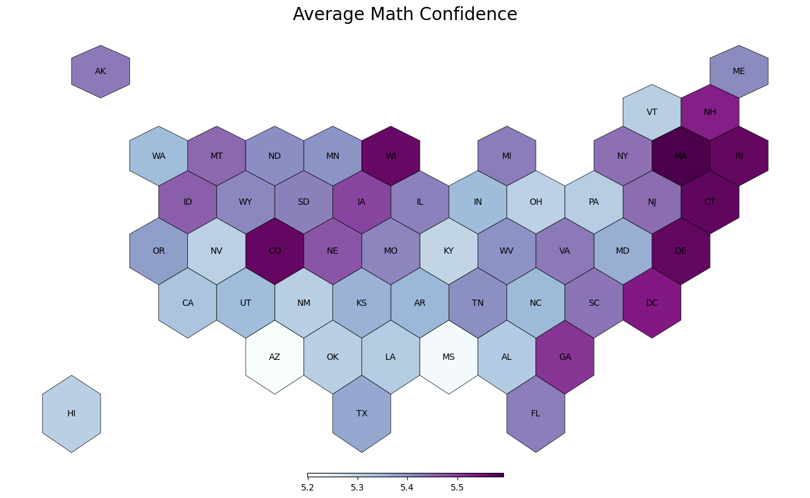
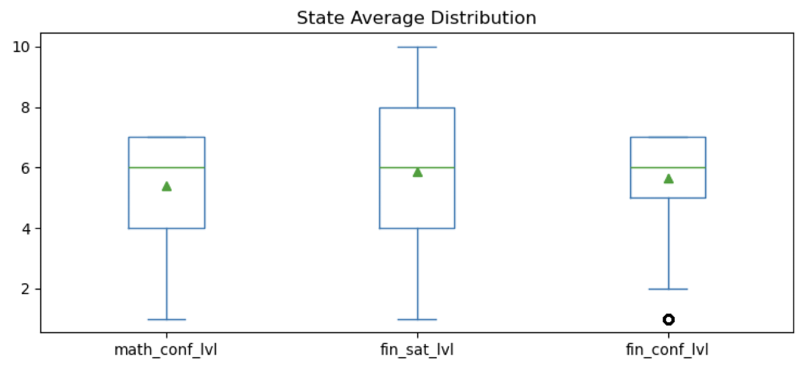
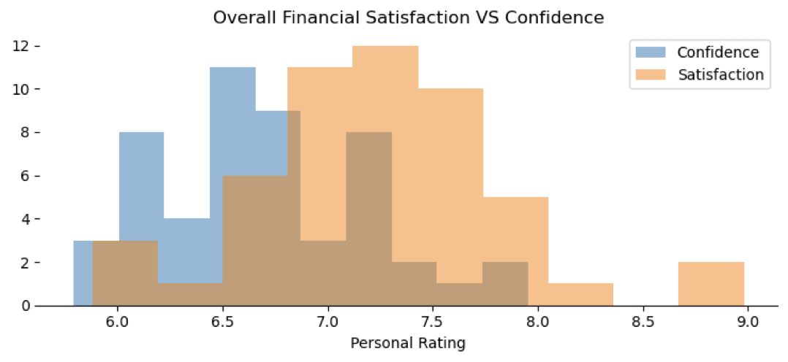
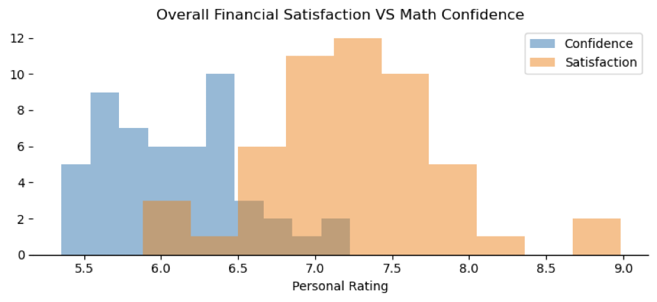
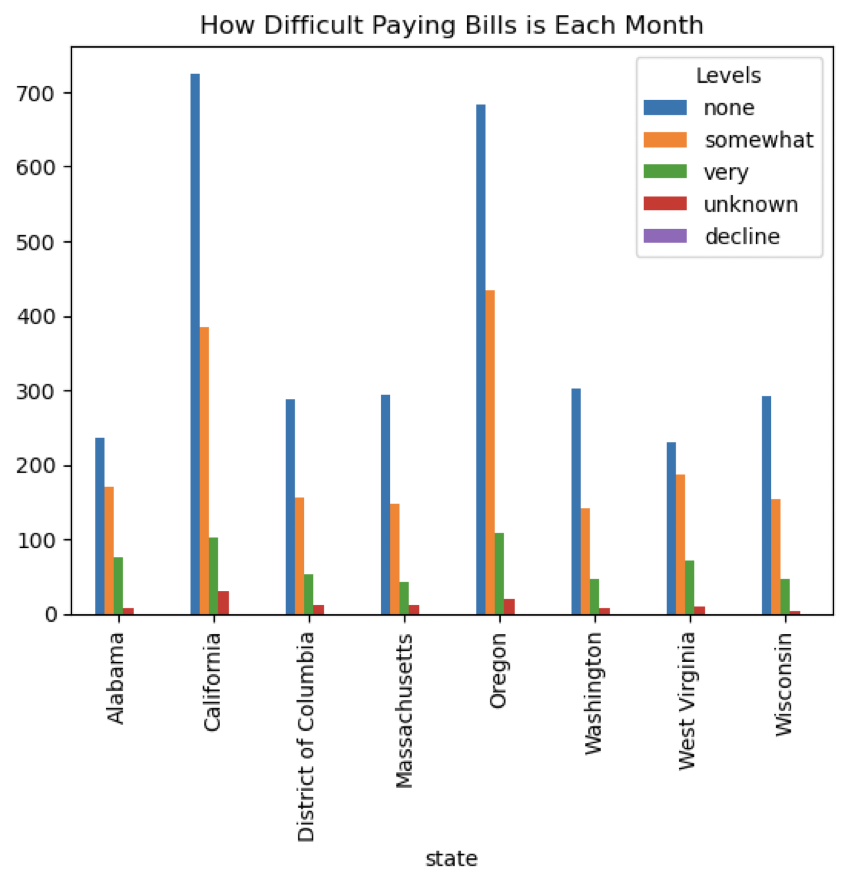
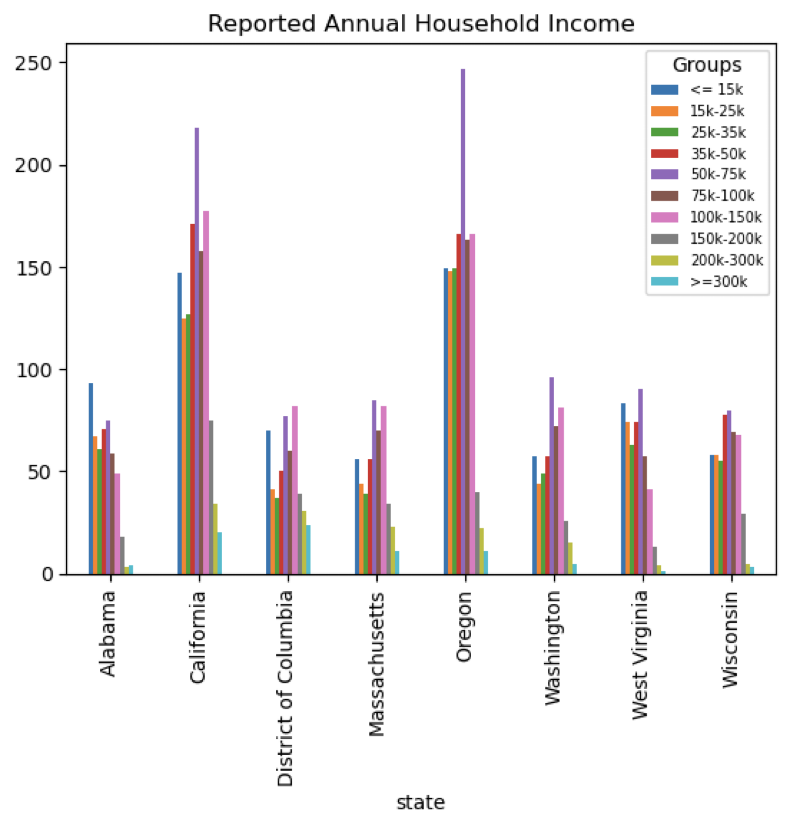
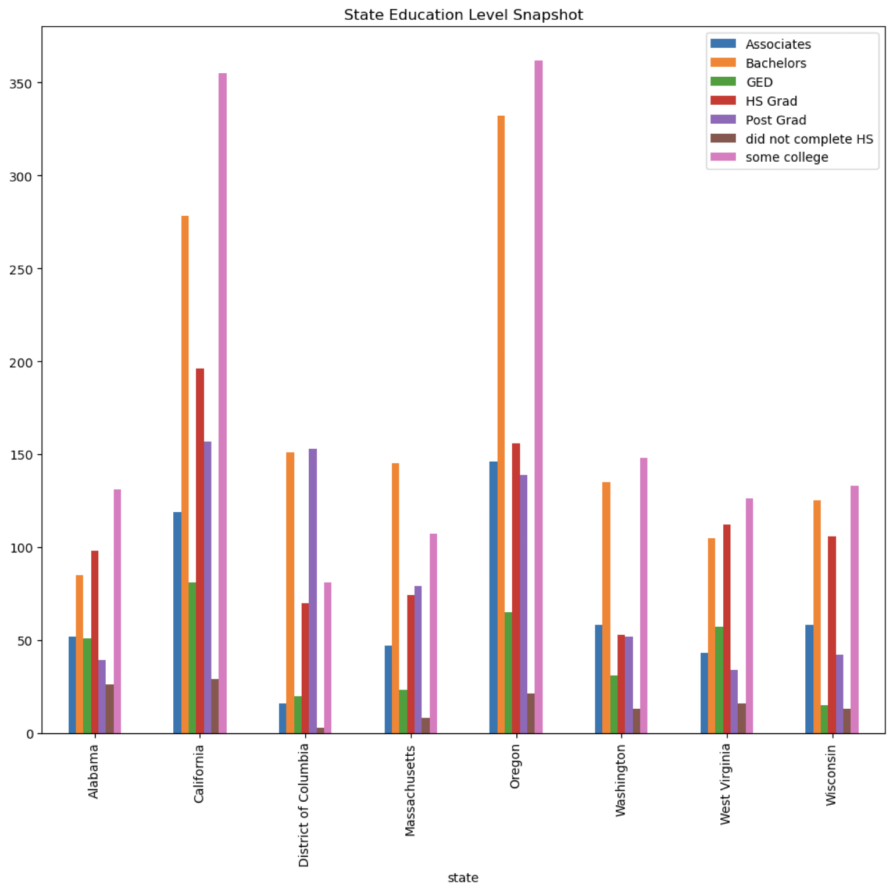
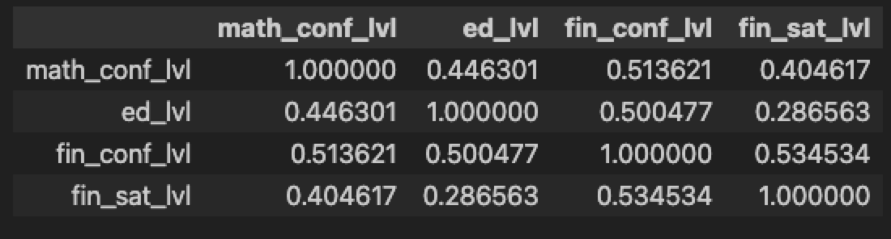

# Exploring Financial Capability Across The United States of America
    For this project I was interested to see how individual factors correlated with financail satisfaction, income, and potentailly  marital status. Additionally, I wanted to see how each state compared to one another. My hypothesis is there is a postive correlation between financial knowledge confidence/education with household anual income/marital status. I also would like to test if any of the features  included in the data fare well in predicting financial satisfaction and/or income. Lastly, for general curisosity, my hopes are to compare some of my findings to the historics data to analyze for potential trands or changes.

## Getting Started

Feel free to fork and clone the [repository](https://github.com/jhardin7612/financial_capability_study) to your local machine.

 Requirements : 
 - **Pands** :
 - **Seaborn** 
 - **GeoPandas**: used to generate hexbin plot. You will also need to load this [file]("https://raw.githubusercontent.com/holtzy/The-Python-Graph-Gallery/master/static/data/us_states_hexgrid.geojson.json") for the geodata dataframe.
 - **Matplotlip.pyplot**
 - **Matplotlib.colors**: specifically import Normalize, as this is used to help generate the hexbin plots

### Usage 
    Currently the repo is in its MVP state. Therefore does not contain any automated scripts for cleaning or visualizations. In order to gain access to those you will need to run the individual notebooks in order. This capability will be first on the next sprint to allow for better reusability and quicker analysis of other NFCS datasets.

## Data Overview
The National Financial Capability Study (NFCS) examines the financial capability as defined by the FINRA Foundation, of over 25,000 U.S. adults. The data is collected via a survey that is sent out every 3 years. All 50 states as well as the District of Columbia are accounted for, with an average of 500 respondents per state. For my MVP, I decided to focus on the 
[2021](https://finrafoundation.org/knowledge-we-gain-share/nfcs/data-and-downloads) data. This dataset is comprised of all categorical values that is represented in numerical format. It contains 27,118 rows and 126 columns in its raw format. The link above will provide access to downlad the data as well as the necessary data file to decipher the numeric categorical values. FINRA also provides an in depth analysis of their findings. 

**Historical Context** : This data was collected during the historic Corona Virus pandemic.

## Cleaning
    Initially, I wanted to change each of the numeric values to its corresponding string value. A lot of this is done through a simple function change_cat_vals() and is visible  throughout the transformations notebook. With this being such a wide dataset, I decided to stick to only a sample of the columns that I felt were the most interesting and likely heavier weighted features. Once the values were swapped, I dropped a bulk of the columns and saved this in a .csv file. 

## Current Findings
    Please note that persons who declined to answer or chose unknown were not accounted for in majority of these graphs.

    The State averages for Financial Satisifaction, or how happy one is with their current finances, aligns well with thier financial confidence, how comfortable they are with handling finances and their confidence in their finacial literacy. Down the line, I would love to look to see how these states performed on the questionnaires designed to test financial literacy concepts like the ability to calculate compound interests and understanding probability. 

    All three metrics seem to hover around the same mean and median value.

    However, when we look at the distribution of personal rankings, I noticed a diiferent trend. Most of the respondents rated lower financial and math skill confidence compared to their overall state of financial happiness. I do notice math and financial confidence have similar right skewed distribution. 

 

    After looking at how the states stacked up against eachother I decided to dive deeper into a handful of the states for further analysis. These 8 states capture the highs and lows of the three focused metrics. I wanted to see if there was an indicator within the data set that might explain some of the survey results.

    My first thought was to look at how difficult each state found it was to pay thier bills each month in relation to their household annual income and education levels. I do think a different graph should have been chosen for income and education, perhaps a violinplot. 

    The state of Oregon will be where I focused on from here.  Oregon has a low financial satifiction level, middle math confidence and high financial confidence scores. However, compared to California that is very similar in bill difficulty, income and education metrics but California has a very high financial satisfaction. 

## Conclusion
    Further analysis would need to be done to prove or disprove my hypothesis. Right now education alone has a low and the lowest correlation with financial satisfaction. Financial Confidence has the highes correlation out of the three, however it is not high enough for me to qualify it has postive. 
